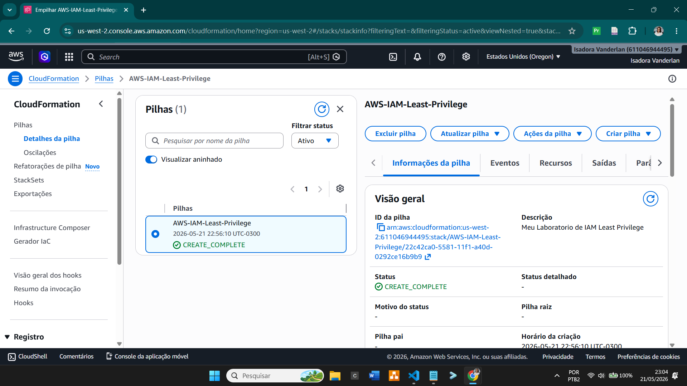
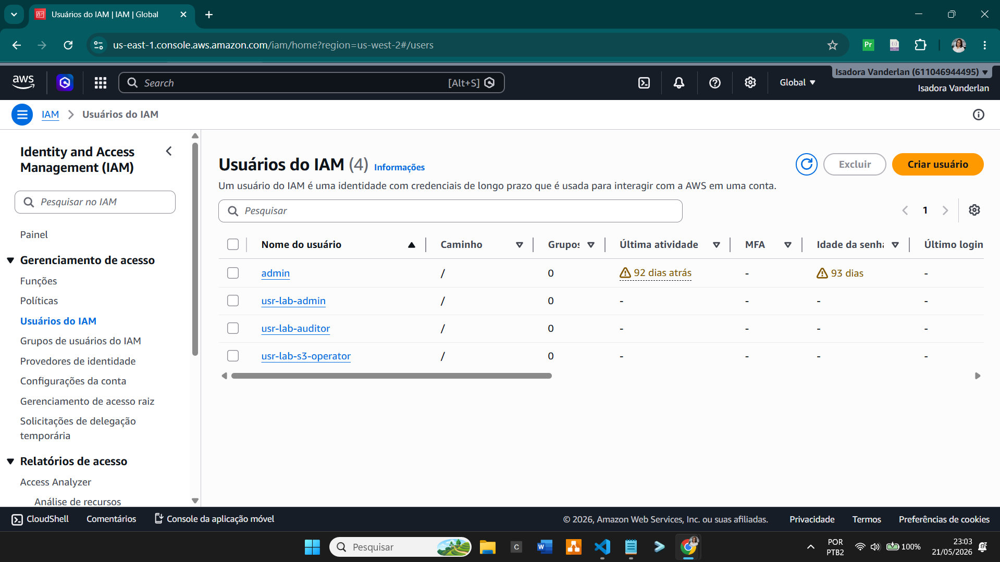
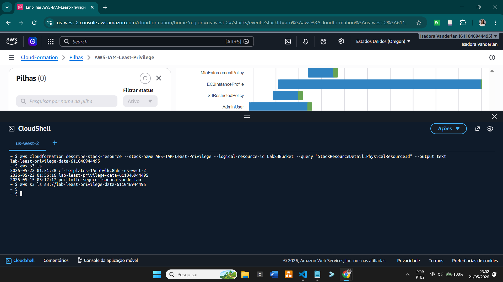

# Meu Laboratório Pessoal: AWS IAM Least Privilege 🛡️

 
Olá! Este projeto é o resultado prático dos meus estudos focados em Cloud Computing.

Estudando na **Escola da Nuvem**, aprendi os conceitos fundamentais de nuvem e arquitetura, decidi criar este laboratório pessoal para colocar a mão na massa.
 

---

## 🧭 O que este projeto demonstra:

Neste laboratório, apliquei o princípio de **Least Privilege (Menor Privilégio)**. Criando o código bloco por bloco.

- **usr-lab-admin**: Um usuário administrador, mas monitorado de perto.
- **usr-lab-auditor**: Um usuário com permissão estrita apenas de leitura e auditoria global.
- **usr-lab-s3-operator**: Um usuário operador focado apenas em dados de um bucket específico.
- **Políticas Customizadas**: O operador do S3 só mexe no bucket do lab, sem bisbilhotar o resto da conta.
- **Bloqueio Global por falta de MFA**: Se o admin tentar mexer na conta sem o Segundo Fator de Autenticação (MFA), a AWS bloqueia ele na hora.
- **IAM Roles para Servidores (EC2)**: A máquina virtual ganha acessos temporários automáticos, eliminando o uso de senhas ou chaves fixas expostas.
- **Rotação de Senhas**: Uma regra na conta obriga a troca de senhas de todos os usuários a cada 90 dias.
   

---

## 🛠️ Como este projeto funciona na prática

Para testar e validar o laboratório, usei o terminal para enviar o código para a AWS e testar os acessos dos usuários:

1. **Testando o funcionamento no Terminal:** Abri o CloudShell e listei o bucket criado pelo projeto para garantir que a estrutura estava pronta e respondendo corretamente via comandos CLI.
   

2. **Verificando os Usuários:** Após o término da automação, a AWS criou com sucesso todos os perfis de acesso direto no painel do IAM conforme planejado.
   

3. **Testando o bloqueio do Operador S3:** Entrei com o usuário operador e tentei listar outros arquivos da conta. A AWS barrou e deu o erro de **Acesso Negado (AccessDenied)**, provando que a trava que criei funcionou. Ele só conseguiu ver o bucket do laboratório.
   

4. **Limpando tudo:** Após os testes, usei o CloudFormation para deletar todos os recursos criados de forma limpa e segura, evitando qualquer custo na minha conta.
    

---

## ✉️ Contato e Conexões

- **LinkedIn**: https://www.linkedin.com/in/isadoravanderlan/
- **E-mail**: vanderlansantos@gmail.com
